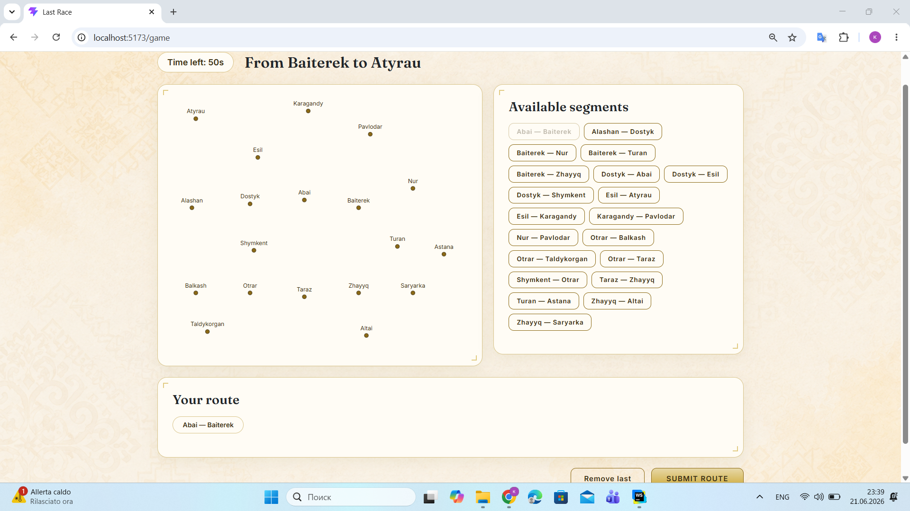
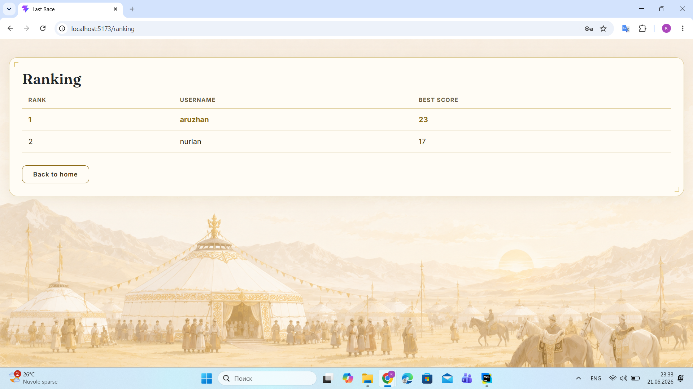

# Exam #1: "Last Race"
## Student: s357940 SADEN ZARINA

## React Client Application Routes

- Route `/`: landing page for anonymous users, shows the game title, a Login button, and a toggleable "How to play" instructions section
- Route `/login`: login form (username and password)
- Route `/home`: home page for logged-in users, with buttons for Ranking, Play, How to play, and Logout
- Route `/logout`: triggers logout and redirects to `/`
- Route `/game`: shows the active game, progressing through Setup, Planning, Execution, and Result phases
- Route `/ranking`: leaderboard showing best score per user

## API Server
## API Server

- POST `/api/sessions`
    - request body: `{ username, password }`
    - response body: `{ id, username }`, or 401 error if credentials are invalid
- DELETE `/api/sessions/current`
    - no request parameters
    - response body: empty (200 status)
- GET `/api/sessions/current`
    - no request parameters
    - response body: `{ id, username }` if authenticated, or 401 error
- GET `/api/network`
    - no request parameters
    - response body: `{ lines: [{id, name, color}], stations: [{id, name, is_interchange}], connections: [{id, line_id, station_id_1, station_id_2, station_1, station_2}] }`
- GET `/api/segments`
    - no request parameters
    - response body: array of `{ id, station_1, station_2 }`
- GET `/api/stations`
    - no request parameters
    - response body: array of `{ id, name, is_interchange }`
- POST `/api/games`
    - no request body
    - response body: `{ gameId, startStation, destStation }`
- POST `/api/games/:id/route`
    - request parameter: `id` (game id); request body: `{ connection_ids: [id, id, ...] }`
    - response body: `{ valid: true, steps, coins_final }`, or `{ valid: false, reason }`
- GET `/api/ranking`
    - no request parameters
    - response body: array of `{ username, best_score }`

## Database Tables

- Table `users` - contains registered users' credentials
- Table `lines` - contains the 5 metro lines, each with a name and a display color
- Table `stations` - contains the 19 metro stations
- Table `line_stations` - associates each station with the line(s) it belongs to
- Table `connections` - contains the segments (pairs of adjacent stations) for each line
- Table `events` - contains the possible random events and their coin effect (-4 to +4)
- Table `games` - contains one row per game played: the user, assigned start/destination stations, final coin total, and validity
- Table `game_route_segments` - contains the step-by-step history of a completed game: which connection was used, which event occurred, and the running coin total at each step

- ...

## Main React Components

- `App` (in `App.jsx`): defines the routes, redirects logged-out users away from protected pages, holds the logged-in user's state
- `LandingPage` (in `LandingPage.jsx`): anonymous landing page with login button and toggleable instructions
- `LoginForm` (in `LoginForm.jsx`): login form and logout handler
- `HomePage` (in `HomePage.jsx`): navigation hub for logged-in users
- `GameController` (in `GameController.jsx`): manages the game's phase state (Setup/Planning/Execution/Result) and the shared game data between phases
- `SetupPhase` (in `SetupPhase.jsx`): shows the full network map before starting a game
- `PlanningPhase` (in `PlanningPhase.jsx`): 90-second timer, dots-only map, segment selection, route building and submission
- `ExecutionPhase` (in `ExecutionPhase.jsx`): step-by-step playback of the submitted route's events and coin changes
- `ResultPhase` (in `ResultPhase.jsx`): shows the final score and reason if the route was invalid
- `RankingPage` (in `RankingPage.jsx`): leaderboard table
- `NetworkMap` (in `NetworkMap.jsx`): SVG rendering of the metro map, supporting a "full" mode (with lines and interchange styling) and a "dots-only" mode

## Screenshot

## Users Credentials

- aruzhan, password123 (has played games)
- nurlan, password123 (has played games)
- zarina, password123 (no games yet)

## Use of AI Tools

I used Claude throughout the development of this project as a guided learning tool. My approach was to write the code myself while Claude explained concepts and reviewed what I had written for bugs and improvements.
Specific uses:
- Reviewing my code for bugs and suggesting improvements
- Discussing design tradeoffs
- Helping design and the CSS styling and color palette for the visual theme
- Generating the background images used on the pages
I wrote the application logic, database schema, and React components myself, and made the final decisions on all design and architecture choices.
